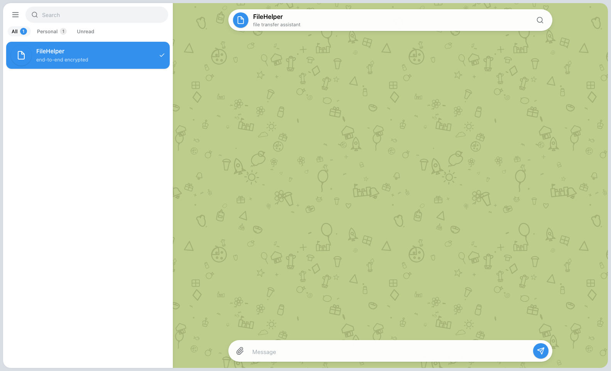
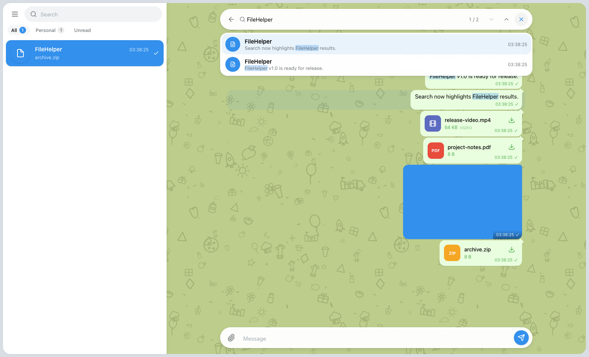
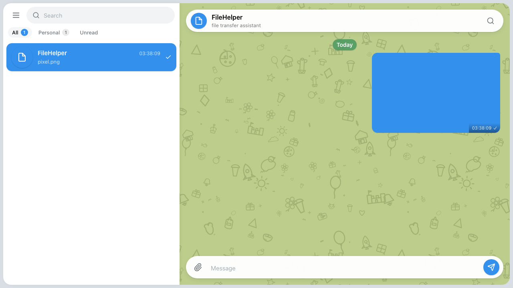
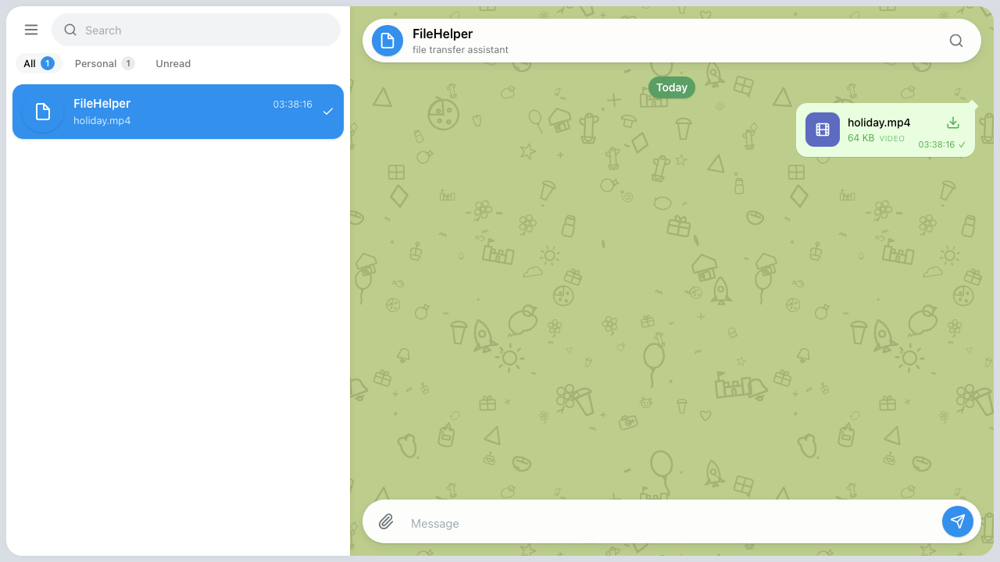
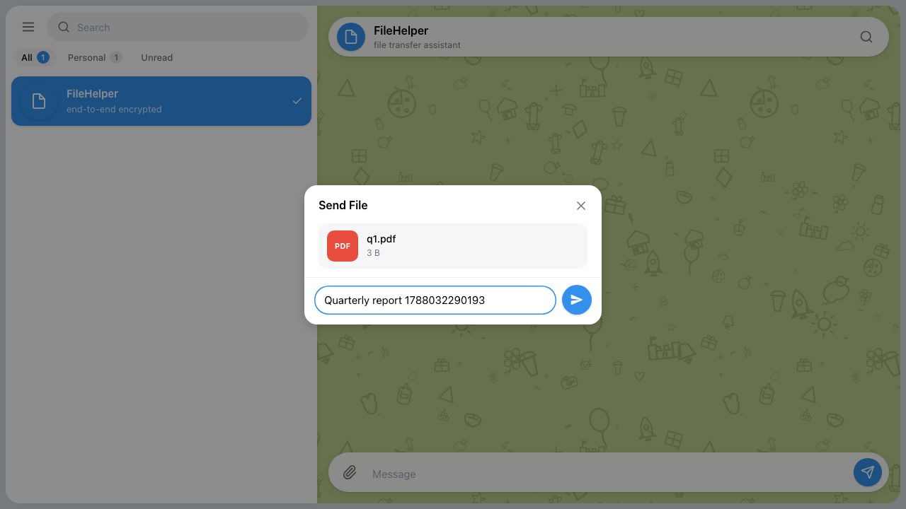
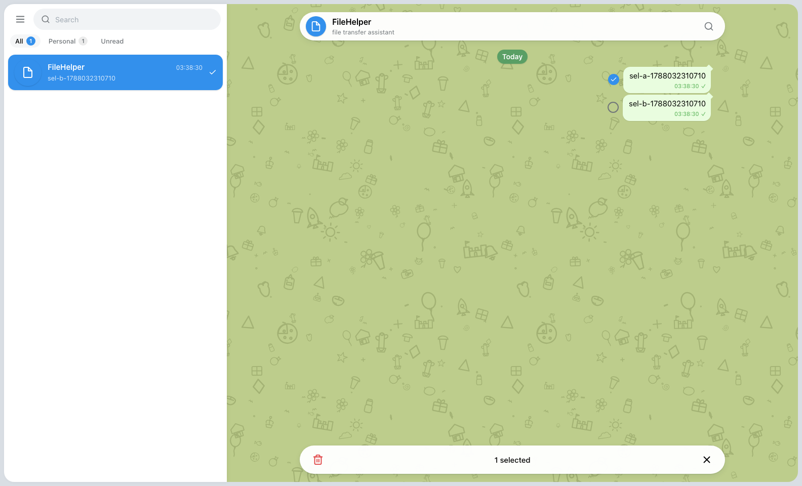
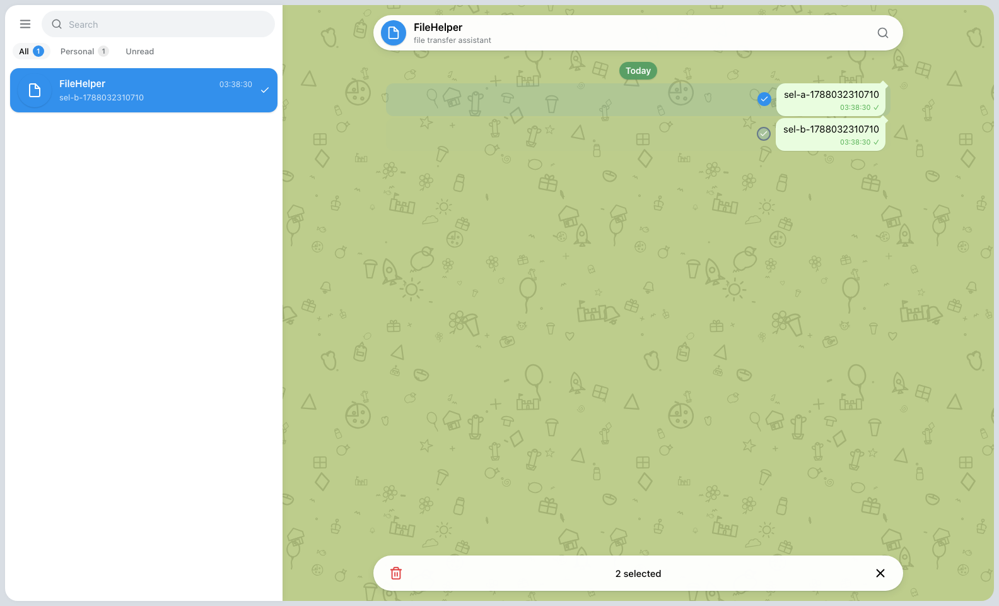
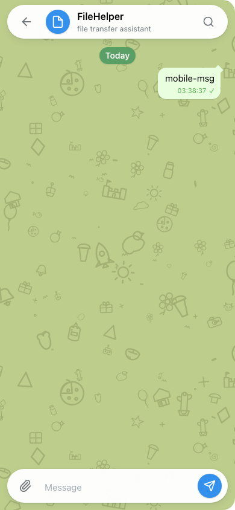
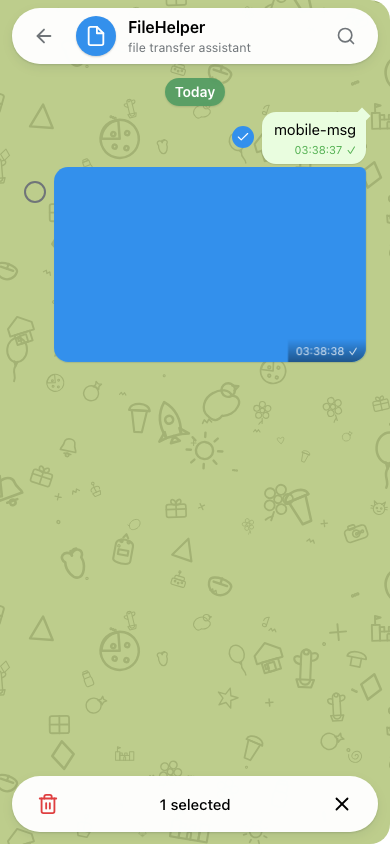

# FileHelper

A tiny end-to-end encrypted file transfer assistant for your local network, powered by Rust.



## Product

No accounts. No registration. No server-generated password.

You only need to understand one thing:

**CODE**

```text
FileHelper
Enter code
[••••••••••••••]
Continue
```

Enter any code you like — Chinese, Tibetan, English, digits, spaces, emoji,
anything. **The same code on another device opens the same files and
messages.** A different code opens a completely separate space.

```text
我的私人文件#2026@Test!     →  space 1
བོད་ཡིགFileHelper✨         →  space 2
Correct Horse Battery Staple → space 3
```

Codes are case-sensitive (`Hello`, `hello` and `HELLO` are three different
spaces) and are normalized with Unicode NFC only — nothing is trimmed,
lowercased or folded. Same code → same keys → same space.

## Quick Start

Linux / macOS:

```bash
./filehelper
```

Windows:

```text
filehelper.exe
```

Then open what the terminal prints:

```text
Open:
  http://192.168.1.23:8080
```

Enter any code. Use the same code on another device to access the same
encrypted messages and files.

## Features

- Telegram Web K-style UI: desktop double column with a floating chat
  header and composer over a patterned wallpaper, mobile single column,
  light & dark themes
- End-to-end encrypted text and file transfer
- Your code is derived in the browser (Scrypt) into separate keys for auth,
  messages and files; the server stores **ciphertext only**
- Per-space isolation: different codes are invisible to each other
- Real-time sync across browsers via WebSocket (space-scoped)
- **Attachments with captions**: pick a file or photo, add a caption in the
  Telegram-style Send File / Send Photo dialog, and send — the caption is
  encrypted with the message, survives refresh, syncs to other devices, and
  is fully searchable
- Client-side search over decrypted history, with automatic jump to the
  newest match, persistent active-result emphasis, and per-term highlight
  in message text, captions and filenames
- Image preview after client-side decryption + magic-header validation
- Videos, audio and other files are download-only file cards
- Telegram-style sidebar: filter chips (All / Personal / Unread), rounded
  search field, and a blue rounded active-chat highlight
- Telegram-style multi-select, selection plate, and delete confirmation
- SQLite persistence; files stored under random UUID names
- Single binary, no runtime dependencies

## Screenshots

### Desktop

| Main | Search |
| --- | --- |
|  |  |

Search runs entirely client-side over decrypted history and jumps directly
to the highlighted match — no extra click needed. Captions and filenames
are searched exactly like message text.

| Image preview | Video (file card only) |
| --- | --- |
|  |  |

| Send File with caption | Multi-select |
| --- | --- |
|  |  |

| Delete confirmation |
| --- |
|  |

### Mobile

| Chat | Selection |
| --- | --- |
|  |  |

All screenshots are captures of the real application running over
end-to-end encrypted demo data.

## Modes

```bash
# Default: keeps your data, same space for the same code
./filehelper

# One-shot run — OS temp data dir, fresh instance, removed on exit
./filehelper --ephemeral
```

## Usage

```bash
filehelper [OPTIONS]

--addr <ADDR>            Listen address (default: 0.0.0.0:8080)
--data-dir <PATH>        Override the data directory
--ephemeral              One-shot run: temp data dir, cleanup on graceful exit
--max-upload-size <SIZE> Max upload size in bytes (default: 10 GiB)
--version, --help
```

## Search

Search is fully client-side: the server can't search for you because it
never sees plaintext. In the current browser tab, FileHelper decrypts the
message metadata it has loaded, progressively backfills older encrypted
history in pages of 500, and matches the query against message text and
decrypted filenames.

As soon as results exist, the chat **auto-jumps to the newest match** —
you never see `1 / N` while still parked somewhere unrelated. The active
result keeps a persistent Telegram-style emphasis while search is open,
every occurrence of the query is highlighted in the message text and in
filenames, and `↑` / `Enter` (older) and `↓` / `Shift+Enter` (newer)
navigate without closing the search. Background loading keeps growing the
result count live; closing the search (Back / ✕ / Escape) removes all
highlights and pauses the backfill, resuming from where it stopped next
time.

No attachment ciphertext is ever downloaded for search — only encrypted
message envelopes. The decrypted in-memory cache lives in the current tab
and is never persisted to localStorage or IndexedDB.

## Data Storage

```
<data dir>/
├── filehelper.db   # SQLite: spaces (auth verifier only), encrypted messages
├── files/          # Encrypted file chunks, UUID-named
├── tmp/            # In-flight encrypted upload parts
├── trash/          # Deleted files awaiting final removal
└── session-secret  # Session token signing key (0600)
```

The server never sees your code, message text, filenames, MIME types, or file
contents. `strings` and hex editors on `filehelper.db` / `files/**` find
nothing readable.

### Legacy data

FileHelper 1.0 uses an encrypted storage format. If a previous pre-E2EE
(plaintext) data directory is found at startup, it is **not** read or
migrated — the whole directory is renamed aside untouched to
`legacy-backup-YYYYMMDD-HHMMSS/` and a fresh encrypted store is created:

```text
Legacy FileHelper data was preserved at:
  /path/to/legacy-backup-20260829-224252
```

## Crypto format (CRYPTO_VERSION = 1)

```text
CODE
 │ NFC normalize
 ▼
Scrypt(N=2^16, r=8, p=1, dkLen=32)  salt = "filehelper/v1/scrypt:" + instanceId
 ▼
root key ──HKDF-SHA256 (domain separation)──▶ space-id / auth / messages / files
```

- `spaceId` = base64url(first 24 bytes of the space key)
- `authKey` → the server stores only `SHA256(authKey)` as the space verifier
- message envelope: `FH1.<nonceB64u>.<ciphertextB64u>` (XChaCha20-Poly1305)
- file chunks: 8 MiB plaintext per chunk, per-file key, per-chunk nonce
  (`prefix || uint64be(index)`), AAD binds space + attachment + chunk index
- plaintext SHA-256 is verified after every download/decrypt

These parameters are frozen. Changing them would derive different keys and
break every existing space; the vector test in `web/src/__tests__/crypto.test.ts`
locks them forever.

## Security

Accurate threat model — nothing is overstated:

- **CODE is processed in the browser.** The server never receives the CODE, the
  root key, or the content keys. Messages and files are encrypted before upload.
- **Anyone with the same CODE can access the same data.** Weak codes are
  vulnerable to offline guessing if the server storage is ever copied. Use a
  long, unique passphrase.
- **Plain HTTP is intended for trusted LANs.** HTTP does not prevent an active
  attacker on your network from modifying the web client (and thus attempting
  to steal your code). On untrusted networks use HTTPS, Tailscale, or WireGuard.
- Server data dir copied → attacker sees ciphertext, sizes, timestamps and
  counts, but not codes, text, filenames, or contents.
- Per-tab Bearer sessions (HMAC-signed, 24 h TTL); every space-scoped query
  goes through `WHERE space_id = ?`. WebSocket events never cross spaces.
- Rate limiting: 5 failed logins / 60 s / IP, 10 space creations / 60 s / IP.
- Security headers on every response: CSP (no video/audio preview),
  `nosniff`, `no-referrer`, `X-Frame-Options: DENY`.

### Web Platform limitation (large downloads over HTTP)

Browsers can only stream a decrypted file to disk through
`showSaveFilePicker`, which requires a secure context. On plain LAN HTTP that
API is often unavailable, and there is no generic "stream to file" fallback.
FileHelper therefore caps the Blob fallback at 128 MiB; larger files over
plain HTTP in such browsers show a clear explanation instead of silently
downloading ciphertext or buffering gigabytes into RAM. Open FileHelper via
HTTPS (or Tailscale) in a compatible Chromium browser for large downloads.

## Build from Source

Requirements: Rust 1.85+ (edition 2024), Node.js 22+ and pnpm (the CI
workflow runs Node 22; the repo's `mise` toolchain uses Rust 1.96 / Node
24 / pnpm 11).

```bash
pnpm --dir web install --frozen-lockfile
pnpm --dir web build        # builds web/dist (embedded into the binary)
cargo build --release
# binary: ./target/release/filehelper
```

## Development

```bash
mise run dev    # backend :8080 + Vite :5173 with /api proxy
mise run test   # fmt + clippy + Rust tests + frontend tests
mise run build  # frontend build + release binary
```

## API Overview

| Method | Path | Description |
|--------|------|-------------|
| GET | `/api/v1/info` | Server info (name, version, instanceId, cryptoVersion, maxUploadSize) |
| POST | `/api/v1/auth/login` | Verify `{spaceId, authKey}` → Bearer session token |
| POST | `/api/v1/auth/create` | Create a new space (rate limited) |
| GET | `/api/v1/messages` | List encrypted messages (cursor pagination) |
| POST | `/api/v1/messages` | Store an encrypted message payload |
| GET | `/api/v1/messages/{id}/context` | Encrypted context window for search jump |
| DELETE | `/api/v1/messages/{id}` | Delete a message (and its file) |
| POST | `/api/v1/messages/batch-delete` | Delete up to 500 ids in one transaction |
| POST | `/api/v1/clear` | Clear the current space only |
| POST | `/api/v1/uploads` | Init an upload → `{uploadId, attachmentId}` |
| PUT | `/api/v1/uploads/{id}/chunks/{i}` | Append one encrypted chunk (sequential) |
| POST | `/api/v1/uploads/{id}/complete` | Finalize: store message + attachment |
| DELETE | `/api/v1/uploads/{id}` | Cancel an upload |
| GET | `/api/v1/files/{id}/download` | Encrypted octet-stream download |
| GET | `/api/v1/storage` | Space-scoped storage stats |
| GET | `/api/v1/ws` | WebSocket (in-band auth frame, space-scoped events) |

## License

MIT
